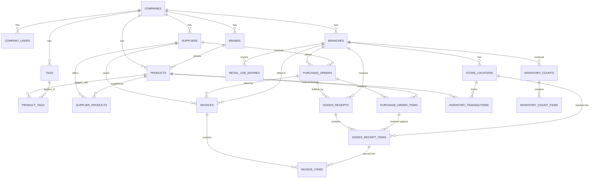

# Project Handoff — MAAX Salon Inventory System

**Status:** Draft schema v2 — client has reviewed and resolved v1's open questions.
**Companion file:** `schema.sql` (Postgres, written for Supabase — uses `gen_random_uuid()` via `pgcrypto`, and includes RLS policies).
**Prepared for:** whoever picks this up next (human or agent) to implement.

---

## 1. Project summary

MAAX PTE LTD runs two salon branches (Min and Kin). They need an inventory system to:
- Order products from suppliers and receive them into stock, split by branch/location
- Classify products as retail, in-house use, or GWP (gift-with-purchase) at the point of ordering
- Round-trip retail-product data with an external system that separately manages retail sales (report out, then manually key in usage reported back)
- Count inventory, optionally scoped by brand/type/tag, and reconcile variances
- Report on costing and low stock (best-sellers/sales reporting deferred — see section 3)

Single-tenant deployment for now (one company, two branches), but the schema is multi-tenant-ready and now includes standard Supabase Row Level Security.

---

## 2. Decisions confirmed by the client (v1 → v2 changes)

| # | Topic | Resolution | What changed in the schema |
|---|---|---|---|
| 1 | Stock quantity | Confirmed: track via `inventory_transactions` ledger, not a column on `products`. | No change from v1 — confirmed as-is. |
| 2 | Type vs tag | `type` = `retail`/`inhouse`/`gwp`/`retail_inhouse` (unchanged enum). `tag` = controlled vocabulary: wash, treatment, colour, retexturise, styling. | Replaced `products.tags text[]` with a proper `tags` lookup table + `product_tags` join table, seeded with the five values. |
| 3 | Where classification lives | Tagged per purchase-order line item (one line = one product = one type). No extra table needed — `purchase_order_items` already links one row to one product. | Added `classification` to `purchase_order_items`. Kept `classification` on `goods_receipt_items` too, but now nullable and auto-filled from the linked PO line via trigger — only required directly for ad-hoc receipts with no PO. |
| 4 | Inventory count scope | By brand, by type, or by any product column. | Added a `brands` table + `products.brand_id`. Added `filter_brand_id`, `filter_classification`, `filter_tag_id` to `inventory_counts`, plus a reserved `additional_filters jsonb` for anything not covered by those three (see open item below). |
| 5 | Best sellers / sales reporting | Deferred. | No sales/best-seller tables or views built in this pass. |
| 6a | PO = unreceived order; auto-receive against ordered qty | Confirmed, and automated. | Added `purchase_order_items.quantity_received`, plus a trigger (`fn_after_goods_receipt_item_insert`) that writes the ledger entry, increments `quantity_received`, and rolls `purchase_orders.status` forward automatically. |
| 6b | Sync receipt lines to invoice | Confirmed. | Added `fn_generate_invoice_items_from_receipt()` to pre-fill `invoice_items` from a `goods_receipt`'s lines, plus an `invoice_reconciliation` view that flags when line items don't sum to the invoice's stated total. |
| 6c | One branch per PO/invoice | Confirmed. | Added `invoices.branch_id` (not null) to match `purchase_orders.branch_id`. |
| 7 | GST registration | Boolean only. | Dropped the `gst_reg_number` column from v1; kept `suppliers.gst_registered boolean`. |
| 8 | RLS | Standard company-scoped isolation. | Added `company_users` (maps Supabase `auth.users` to a company) and a `fn_my_company_ids()` helper. Every table now has RLS enabled with a company-isolation policy — see section 6. |

---

## 3. Remaining open items

These are new questions raised by the changes above, or things deliberately left out of scope — flag with the client before building further:

1. **Over-receiving isn't blocked.** The receiving trigger updates `quantity_received` and rolls PO status forward, but nothing stops a receipt from exceeding `quantity_ordered`. Currently it's allowed and just recorded. If the business wants a hard stop or a warning at that point, that's a small addition to `fn_after_goods_receipt_item_insert`.
2. **`additional_filters jsonb` on `inventory_counts` is a placeholder, not functional.** True "filter by any column" needs dynamic SQL (safe parameterised query-building in the app layer, or a plpgsql function using `EXECUTE`). The three explicit filter columns (brand/type/tag) cover the examples given; anything beyond that needs to be built when a concrete case comes up.
3. **RLS is permissive, not role-based.** Any user in `company_users` can read and write everything for their company — there's no "manager can void an invoice, staff can't" distinction yet, because no role/permission model was specified. Add narrower policies per table once roles are defined.
4. **Best sellers / sales reporting is fully deferred** (per decision #5) — no schema exists for it yet. When it's picked back up, the earlier note still applies: this system has no direct sales data, only receipts and retail-use entries, so "best seller" will need either a defined proxy metric or a real sales feed from the external retail system.
5. **No auth/user model beyond `company_users`.** `created_by`/`received_by`/`counted_by`/`keyed_in_by` fields are still plain `text`, not foreign keys to `auth.users`. Worth deciding whether to tighten these once the app's user-facing auth is built.

---

## 4. Entity overview

| Table | Purpose |
|---|---|
| `companies` | Tenant. One row (MAAX PTE LTD) today. |
| `company_users` | Maps auth users to companies — drives RLS. |
| `branches` | Min and Kin, with manager contacts. |
| `store_locations` | User-defined areas within a branch. Self-referencing for optional nesting. |
| `tax_rates` | Lookup so tax isn't a raw duplicated number everywhere. |
| `brands` | Product brand lookup — used for filtering/counting. |
| `tags` | Controlled tag vocabulary (wash, treatment, colour, retexturise, styling). |
| `suppliers` | Supplier contact + ordering + GST flag. |
| `products` | Catalog. No quantity, no tags array — see decisions #1 and #2. |
| `product_tags` | Many-to-many: products ↔ tags. |
| `supplier_products` | Many-to-many: which suppliers carry which products, at what cost/SKU. |
| `purchase_orders` / `purchase_order_items` | The "create order" workflow. Classification lives on the line item. |
| `invoices` / `invoice_items` | Supplier invoices, reconciled against receipts. |
| `goods_receipts` / `goods_receipt_items` | The "receive order" workflow — stock enters here, split by location. |
| `inventory_transactions` | The ledger. Every stock movement, of any kind, lands here. |
| `report_exports` | Log of the outbound retail-product report sent to the external system. |
| `retail_use_entries` | Manual entry of the retail-use report received back from the external system. |
| `inventory_counts` / `inventory_count_items` | Physical count sessions, optionally scoped by location/brand/type/tag, and their variances. |
| `current_stock` (view) | Derived on-hand quantity per product/location. |
| `low_stock_alerts` (view) | Products at or below their reorder threshold. |
| `invoice_reconciliation` (view) | Flags invoices whose line items don't sum to the stated total. |

---

## 5. Entity relationships (Mermaid)

---

## 6. Workflow → schema mapping

**Create order from inventory system**
1. User picks a supplier, then products (or creates a new `products` row inline if the SKU doesn't exist yet).
2. Insert `purchase_orders` (status `draft`), then `purchase_order_items` per product — **each line now also sets `classification`** (retail/inhouse/gwp/retail_inhouse), at the agreed price.
3. On sending to supplier, update status to `sent`.

**Receive order** *(now largely automated by the database)*
1. Insert a `goods_receipts` row against the `purchase_order_id` (or standalone, if there's no PO).
2. For each product received: insert `goods_receipt_items` with `purchase_order_item_id` (if applicable), `store_location_id`, `quantity_received`, `unit_cost` (post-discount), `purchase_discount_amount`. **Classification is filled in automatically** from the linked PO line by `trg_default_receipt_item_classification` — you only need to pass it explicitly for ad-hoc receipts.
3. **A trigger (`trg_after_goods_receipt_item_insert`) automatically**: writes the `inventory_transactions` row that increases stock, adds to `purchase_order_items.quantity_received`, and rolls `purchase_orders.status` to `partially_received` or `received`.
4. To turn a receipt into an invoice: call `fn_generate_invoice_items_from_receipt(invoice_id, goods_receipt_id)` to pre-fill `invoice_items` from what was actually received, then check `invoice_reconciliation` — a non-zero `variance` means the lines don't match the invoice's stated total (e.g. an extra discount needs to be applied) before marking it paid.

**Send retail product report to external system**
1. Query products flagged retail (via `purchase_order_items.classification` history, or `products.default_classification`) with current stock from `current_stock`.
2. Export as a file/report for the employee to hand off manually.
3. Log the export in `report_exports` for an audit trail.

**Receive retail use report from external system**
1. Employee keys in usage line by line into `retail_use_entries`.
2. Each entry should also insert a matching `inventory_transactions` row (`txn_type = 'retail_use'`, negative `quantity_change`) — this one isn't automated by a trigger yet, since it depends on how the manual entry UI is built.

**Inventory count**
1. Start a session in `inventory_counts`, scoped however's needed: a `store_location_id`, a `filter_brand_id`, a `filter_classification`, a `filter_tag_id`, or a combination.
2. App resolves which products are in scope from those filters, then inserts `inventory_count_items` with `expected_quantity` (snapshotted from `current_stock`) and `counted_quantity`.
3. For every non-zero `variance`, insert a corresponding `inventory_transactions` row (`txn_type = 'count_adjustment'`) to reconcile the ledger.

**Reports**
- *Inventory costing:* join `inventory_transactions` back to `goods_receipt_items.unit_cost` to value stock movements over time.
- *Low inventory warnings:* the `low_stock_alerts` view, driven by `products.low_stock_threshold`.
- *Best sellers / sales:* deferred (open item #4).

---

## 7. Suggested build order

1. Run `schema.sql` against the Supabase project (via the MCP server already configured, or the SQL editor).
2. Insert the one `companies` row and your `company_users` mappings, then run the seed insert at the bottom of `schema.sql` to populate the five tags.
3. Build "create order" and "receive order" first — everything else depends on stock entering the ledger correctly, and receiving now does most of the heavy lifting automatically via triggers.
4. Add the invoice sync/reconciliation step.
5. Add the retail report round-trip (export + manual entry).
6. Add inventory counts, including the brand/type/tag scoping.
7. Build costing/low-stock reporting once there's real transaction data to validate against.
8. Revisit RLS once real roles are defined (open item #3).

---

## 8. Out of scope for this pass

- Best sellers / sales reporting (deferred by client request)
- Role-based permissions beyond company-level isolation
- Direct API integration with the external retail system (explicitly report-based, not API)
- Multi-currency support
- Barcode/SKU scanning hardware integration
